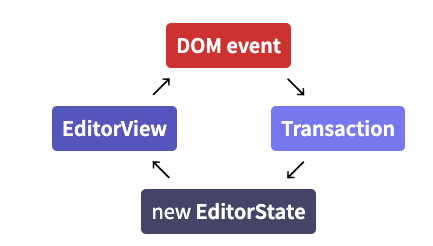

# ProseMirror 指南

本指南描述了库中使用的各种概念，以及它们之间的相互关系。为了全面了解该系统，建议按照本文呈现的顺序阅读，至少读到视图组件部分。

## 简介 (Introduction)

ProseMirror 提供了一套用于构建富文本编辑器的工具和概念，其用户界面受“所见即所得”（WYSIWYG）启发，但试图避免这种编辑风格的陷阱。

ProseMirror 的主要原则是，你的代码对文档及其发生的一切拥有完全的控制权。这个文档不是一团 HTML，而是一个自定义的数据结构，只包含你明确允许它包含的元素，并且遵循你指定的关系。所有的更新都通过一个单一的点进行，你可以在那里检查并对它们做出反应。

核心库并不是一个简单的即插即用组件——我们优先考虑模块化和可定制性，而不是简单性，希望将来人们会分发基于 ProseMirror 的即插即用编辑器。因此，这更像是一套乐高积木，而不是一辆火柴盒小汽车。

有四个基本模块是进行任何编辑所必需的，还有一些由核心团队维护的扩展模块，它们的地位类似于第三方模块——它们提供有用的功能，但你可以省略它们，或用实现类似功能的其他模块替换它们。

基本模块包括：

*   [prosemirror-model](https://prosemirror.net/docs/ref/#model) 定义了编辑器的文档模型，即用于描述编辑器内容的数据结构。
*   [prosemirror-state](https://prosemirror.net/docs/ref/#state) 提供了描述编辑器整个状态的数据结构，包括选区，以及从一个状态转移到下一个状态的事务系统。
*   [prosemirror-view](https://prosemirror.net/docs/ref/#view) 实现了一个用户界面组件，将给定的编辑器状态显示为浏览器中的可编辑元素，并处理用户与该元素的交互。
*   [prosemirror-transform](https://prosemirror.net/docs/ref/#transform) 包含以一种可以被记录和重放的方式修改文档的功能，这是 `state` 模块中事务的基础，也使得撤销历史和协同编辑成为可能。

此外，还有用于[基本编辑命令](https://prosemirror.net/docs/ref/#commands)、[绑定按键](https://prosemirror.net/docs/ref/#keymap)、[撤销历史](https://prosemirror.net/docs/ref/#history)、[输入宏](https://prosemirror.net/docs/ref/#inputrules)、[协同编辑](https://prosemirror.net/docs/ref/#collab)、[简单文档 schema](https://prosemirror.net/docs/ref/#schema-basic) 等模块，更多内容请见 [GitHub prosemirror 组织](https://github.com/prosemirror/)。

ProseMirror 不作为单个浏览器可加载的脚本分发，这意味着你在使用它时可能需要使用某种打包工具。打包工具是一种自动查找脚本依赖项并将其组合成一个可以轻松从网页加载的大文件的工具。你可以在网上阅读更多关于打包的内容，例如[这里](https://medium.freecodecamp.org/javascript-modules-part-2-module-bundling-5020383cf306)。

### 我的第一个编辑器 (My first editor)

像这样将乐高积木拼在一起，就可以创建一个非常简单的编辑器：

```javascript
import {schema} from "prosemirror-schema-basic"
import {EditorState} from "prosemirror-state"
import {EditorView} from "prosemirror-view"

let state = EditorState.create({schema})
let view = new EditorView(document.body, {state})
```

ProseMirror 要求你指定文档所遵循的 schema（模式），所以这第一件事就是导入一个包含基本 schema 的模块。

然后使用该 schema 创建一个状态，这将生成一个符合该 schema 的空文档，以及该文档开头的默认选区。最后，为该状态创建一个视图，并将其附加到 `document.body`。这将把状态的文档渲染为一个可编辑的 DOM 节点，并在用户输入时生成状态事务。

这个编辑器还不是很好用。例如，如果你按回车键，什么也不会发生，因为核心库对回车键应该做什么没有任何意见。我们稍后会讲到这一点。

### 事务 (Transactions)

当用户输入或以其他方式与视图交互时，它会生成“状态事务”。这意味着它不仅仅是就地修改文档并以这种方式隐式更新其状态。相反，每一个变化都会导致创建一个事务，该事务描述了对状态所做的更改，并可以应用它来创建一个新状态，然后用于更新视图。

默认情况下，这一切都在幕后发生，但你可以通过编写插件或配置视图来介入。例如，这段代码添加了一个 [dispatchTransaction](https://prosemirror.net/docs/ref/#view.DirectEditorProps.dispatchTransaction) [prop](https://prosemirror.net/docs/ref/#view.EditorProps)，每当创建一个事务时都会调用它：

```javascript
// (Imports omitted)

let state = EditorState.create({schema})
let view = new EditorView(document.body, {
  state,
  dispatchTransaction(transaction) {
    console.log("Document size went from", transaction.before.content.size,
                "to", transaction.doc.content.size)
    let newState = view.state.apply(transaction)
    view.updateState(newState)
  }
})
```

每个状态更新都必须经过 [updateState](https://prosemirror.net/docs/ref/#view.EditorView.updateState)，并且每个正常的编辑更新都将通过分发事务发生。

### 插件 (Plugins)

插件用于以各种方式扩展编辑器和编辑器状态的行为。有些相对简单，比如将操作绑定到键盘输入的 [keymap](https://prosemirror.net/docs/ref/#keymap) 插件。其他的则更复杂，比如 [history](https://prosemirror.net/docs/ref/#history) 插件，它通过观察事务并存储它们的逆操作来实现撤销历史，以防用户想要撤销它们。

让我们将这两个插件添加到我们的编辑器中，以获得撤销/重做功能：

```javascript
// (Omitted repeated imports)
import {undo, redo, history} from "prosemirror-history"
import {keymap} from "prosemirror-keymap"

let state = EditorState.create({
  schema,
  plugins: [
    history(),
    keymap({"Mod-z": undo, "Mod-y": redo})
  ]
})
let view = new EditorView(document.body, {state})
```

插件在创建状态时注册（因为它们需要访问状态事务）。为这个启用了历史记录的状态创建视图后，你就可以按 Ctrl-Z（或 OS X 上的 Cmd-Z）来撤销你最后的更改。

### 命令 (Commands)

上一个示例绑定到按键的 `undo` 和 `redo` 值是一种称为命令的特殊函数。大多数编辑操作都被编写为命令，可以绑定到按键、挂钩到菜单或以其他方式暴露给用户。

`prosemirror-commands` 包提供了许多基本的编辑命令，以及一个最小的键盘映射，你可能希望启用它，以便让回车和删除等操作在你的编辑器中按预期工作。

```javascript
// (Omitted repeated imports)
import {baseKeymap} from "prosemirror-commands"

let state = EditorState.create({
  schema,
  plugins: [
    history(),
    keymap({"Mod-z": undo, "Mod-y": redo}),
    keymap(baseKeymap)
  ]
})
let view = new EditorView(document.body, {state})
```

此时，你已经拥有了一个基本可用的编辑器。

要添加菜单、针对特定 schema 的额外键绑定等，你可能想看看 [prosemirror-example-setup](https://github.com/prosemirror/prosemirror-example-setup) 包。这是一个模块，为你提供了一组插件来设置一个基准编辑器，但正如其名所示，它更多是作为一个示例，而不是一个生产级别的库。对于实际部署，你可能希望用自定义代码替换它，以完全按照你想要的方式设置事物。

### 内容 (Content)

状态的文档位于其 [doc](https://prosemirror.net/docs/ref/#state.EditorState.doc) 属性下。这是一个只读的数据结构，将文档表示为节点的层次结构，有点像浏览器 DOM。一个简单的文档可能是一个包含两个 `"paragraph"`（段落）节点的 `"doc"` 节点，每个段落节点包含一个 `"text"`（文本）节点。

初始化状态时，你可以给它一个初始文档。在这种情况下，`schema` 字段是可选的，因为 schema 可以从文档中获取。

在这里，我们通过解析 ID 为 `"content"` 的 DOM 元素中的内容来初始化状态，使用 DOM 解析器机制，该机制使用 schema 提供的关于哪些 DOM 节点映射到该 schema 中哪些元素的信息：

```javascript
import {DOMParser} from "prosemirror-model"
import {EditorState} from "prosemirror-state"
import {schema} from "prosemirror-schema-basic"

let content = document.getElementById("content")
let state = EditorState.create({
  doc: DOMParser.fromSchema(schema).parse(content)
})
```

## 文档 (Documents)

ProseMirror 定义了自己的[数据结构](https://prosemirror.net/docs/ref/#model.Node)来表示内容文档。由于文档是构建编辑器其余部分的中心元素，因此了解它们的工作原理很有帮助。

### 结构 (Structure)

ProseMirror 文档是一个 [节点 (node)](https://prosemirror.net/docs/ref/#model.Node)，它持有一个包含零个或多个子节点的 [片段 (fragment)](https://prosemirror.net/docs/ref/#model.Fragment)。

这很像 [浏览器 DOM](https://developer.mozilla.org/en-US/docs/Web/API/Document_Object_Model)，因为它是递归的且呈树状。但它在存储内联内容的方式上与 DOM 不同。

在 HTML 中，带有标记的段落表示为一棵树，如下所示：

```html
<p>This is <strong>strong text with <em>emphasis</em></strong></p>
```

而在 ProseMirror 中，内联内容被建模为一个扁平序列，标记作为元数据附加到节点上：


这更符合我们倾向于思考和处理此类文本的方式。它允许我们使用字符偏移量而不是树中的路径来表示段落中的位置，并且使得执行诸如拆分或更改内容样式等操作变得更容易，而无需执行笨拙的树操作。

这也意味着每个文档都有一个有效的表示形式。具有相同标记集的相邻文本节点总是合并在一起，并且不允许空文本节点。标记出现的顺序由 schema 指定。

所以 ProseMirror 文档是一个块节点的树，其中大多数叶节点是文本块，即包含文本的块节点。你也可以有简单的空叶块，例如水平线或视频元素。

节点对象带有许多属性，反映了它们在文档中扮演的角色：

*   `isBlock` 和 `isInline` 告诉你给定节点是块节点还是内联节点。
*   `inlineContent` 对于期望内联节点作为内容的节点为真。
*   `isTextblock` 对于具有内联内容的块节点为真。
*   `isLeaf` 告诉你节点不允许任何内容。

因此，典型的 `"paragraph"` 节点将是一个文本块，而引用块可能是一个内容由其他块组成的块元素。文本、硬换行和内联图像是内联叶节点，水平线节点将是块叶节点的一个例子。

Schema 允许对什么可以出现在哪里指定更精确的约束——即，即使一个节点允许块内容，这并不意味着它允许所有块节点作为内容。

### 身份和持久性 (Identity and persistence)

DOM 树和 ProseMirror 文档之间的另一个重要区别是表示节点的对象行为方式。在 DOM 中，节点是具有身份的可变对象，这意味着一个节点只能出现在一个父节点中，并且当它被更新时，节点对象本身会发生突变。

另一方面，在 ProseMirror 中，节点只是值，应该像对待表示数字 3 的值那样对待它们。3 可以同时出现在多个数据结构中，它没有指向它当前所属数据结构的父链接，如果你给它加 1，你会得到一个新的值 4，而不会改变原来的 3。

ProseMirror 文档的片段也是如此。它们不会改变，但可以用作计算修改后的文档片段的起始值。它们不知道自己属于什么数据结构，但可以是多个结构的一部分，甚至在一个结构中出现多次。它们是值，不是有状态的对象。

这意味着每次更新文档时，你都会得到一个新的文档值。该文档值将与原始文档值共享所有未更改的子节点，从而使其创建成本相对较低。

这有一堆优点。它使得在更新期间不可能让编辑器处于无效的中间状态，因为新状态（带有新文档）可以瞬间换入。这也使得以某种数学方式推理文档变得更容易，如果你的值在你脚下不断变化，这真的很难。这有助于使协同编辑成为可能，并允许 ProseMirror 通过将上次绘制到屏幕的文档与当前文档进行比较来运行非常高效的 DOM [更新](https://prosemirror.net/docs/ref/#view.EditorView.update)算法。

因为这些节点由常规 JavaScript 对象表示，并且显式[冻结](https://developer.mozilla.org/en-US/docs/Web/JavaScript/Reference/Global_Objects/Object/freeze)其属性会妨碍性能，所以实际上是可以更改它们的。但不支这样做，并且会导致问题，因为它们几乎总是在多个数据结构之间共享。所以要小心！请注意，这也适用于作为节点对象一部分的数组和普通对象，例如用于存储节点属性的对象或片段中的子节点数组。

### 数据结构 (Data structures)

文档的对象结构看起来像这样：

| Node | |
| --- | --- |
| type: | NodeType |
| content: | Fragment [ Node , Node , ...] |
| attrs: | Object |
| marks: | [ Mark , ...] |

每个节点由 [Node](https://prosemirror.net/docs/ref/#model.Node) 类的一个实例表示。它标记有一个 [type](https://prosemirror.net/docs/ref/#model.NodeType)，该类型知道节点的名称、对其有效的属性等。节点类型（和标记类型）每个 schema 创建一次，并且知道它们属于哪个 schema。

节点的内容存储在 [Fragment](https://prosemirror.net/docs/ref/#model.Fragment) 的实例中，它保存一系列节点。即使对于没有或不允许内容的节点，此字段也会被填充（使用共享的 [空片段](https://prosemirror.net/docs/ref/#model.Fragment%5Eempty)）。

一些节点类型允许属性，这些属性是与每个节点一起存储的额外值。例如，图像节点可能使用这些来存储其 alt 文本和图像的 URL。

此外，内联节点拥有一组活动标记——如强调或链接——它们表示为 [Mark](https://prosemirror.net/docs/ref/#model.Mark) 实例的数组。

完整的文档只是一个节点。文档内容表示为顶级节点的子节点。通常，它将包含一系列块节点，其中一些可能是包含内联内容的文本块。但顶级节点本身也可以是文本块，以便文档仅包含内联内容。

什么类型的节点允许在哪里由文档的 schema 决定。要以编程方式创建节点，你必须通过 schema，例如使用 [node](https://prosemirror.net/docs/ref/#model.Schema.node) 和 [text](https://prosemirror.net/docs/ref/#model.Schema.text) 方法。

```javascript
import {schema} from "prosemirror-schema-basic"

// (null 参数是你可以指定属性的地方，如果有必要的话。)
let doc = schema.node("doc", null, [
  schema.node("paragraph", null, [schema.text("One.")]),
  schema.node("horizontal_rule"),
  schema.node("paragraph", null, [schema.text("Two!")])
])
```

### 索引 (Indexing)

ProseMirror 节点支持两种类型的索引——它们可以被视为树，使用单个节点的偏移量，或者它们可以被视为扁平的标记序列。

第一种允许你做类似于你在 DOM 中做的事情——与单个节点交互，使用 [child 方法](https://prosemirror.net/docs/ref/#model.Node.child) 和 [childCount](https://prosemirror.net/docs/ref/#model.Node.childCount) 直接访问子节点，编写递归函数扫描文档（如果你只想查看所有节点，请使用 [descendants](https://prosemirror.net/docs/ref/#model.Node.descendants) 或 [nodesBetween](https://prosemirror.net/docs/ref/#model.Node.nodesBetween)）。

第二种在寻址文档中的特定位置时更有用。它允许任何文档位置表示为一个整数——标记序列中的索引。这些标记实际上并不作为内存中的对象存在——它们只是一个计数约定——但文档的树形结构，以及每个节点都知道其大小的事实，被用来使按位置访问变得廉价。

*   文档的开始，即第一个内容之前，是位置 0。
*   进入或离开非叶节点（即支持内容的节点）计为一个标记。因此，如果文档以段落开头，则该段落的开头计为位置 1。
*   文本节点中的每个字符计为一个标记。因此，如果文档开头的段落包含单词“hi”，则位置 2 在“h”之后，位置 3 在“i”之后，位置 4 在整个段落之后。
*   不允许内容的叶节点（如图像）也计为单个标记。

因此，如果你有一个文档，当表示为 HTML 时看起来像这样：

```html
<p>One</p>
<blockquote><p>Two</p></blockquote>
```

标记序列及位置如下所示：

```
0   1 2 3 4    5
 <p> O n e </p>

5            6   7 8 9 10    11   12            13
 <blockquote> <p> T w o  </p> </blockquote>
```

每个节点都有一个 [nodeSize](https://prosemirror.net/docs/ref/#model.Node.nodeSize) 属性，为你提供整个节点的大小，你可以访问 [.content.size](https://prosemirror.net/docs/ref/#model.Fragment.size) 来获取节点内容的大小。请注意，对于外部文档节点，打开和关闭标记不被视为文档的一部分（因为你不能将光标放在文档之外），因此文档的大小是 `doc.content.size`，而不是 `doc.nodeSize`。

手动解释这些位置涉及大量的计数。你可以调用 [Node.resolve](https://prosemirror.net/docs/ref/#model.Node.resolve) 来获取一个更具描述性的位置 [数据结构](https://prosemirror.net/docs/ref/#model.ResolvedPos)。该数据结构将告诉你位置的父节点是什么，它在该父节点中的偏移量是多少，父节点有哪些祖先，以及其他一些事情。

请注意区分及子索引（根据 [childCount](https://prosemirror.net/docs/ref/#model.Node.childCount)）、文档范围的位置和节点本地偏移量（有时在递归函数中用于表示当前正在处理的节点中的位置）。

### 切片 (Slices)

为了处理复制粘贴和拖放等事情，必须能够谈论文档的切片，即两个位置之间的内容。这种切片与完整的节点或片段不同，因为其开始或结束处的某些节点可能是“开放的”。

例如，如果你从一个段落的中间选择到下一个段落的中间，你选择的切片中有两个段落，第一个在开始处开放，第二个在结束处开放，而如果你节点选择一个段落，你就选择了一个封闭的节点。这种开放节点中的内容如果像节点的完整内容一样处理，可能会违反 schema 约束，因为一些必需的节点落在了切片之外。

[Slice](https://prosemirror.net/docs/ref/#model.Slice) 数据结构用于表示此类切片。它存储一个 [fragment](https://prosemirror.net/docs/ref/#model.Fragment) 以及两侧的 [开放深度](https://prosemirror.net/docs/ref/#model.Slice.openStart)。你可以使用节点上的 [slice 方法](https://prosemirror.net/docs/ref/#model.Node.slice) 从文档中切出一个切片。

```javascript
// doc holds two paragraphs, containing text "a" and "b"
let slice1 = doc.slice(0, 3) // The first paragraph
console.log(slice1.openStart, slice1.openEnd) // → 0 0
let slice2 = doc.slice(1, 5) // From start of first paragraph
                             // to end of second
console.log(slice2.openStart, slice2.openEnd) // → 1 1
```

### 更改 (Changing)

由于节点和片段是 [持久的](https://en.wikipedia.org/wiki/Persistent_data_structure)，你不应该改变它们。如果你有一个文档（或节点，或片段）的句柄，该对象将保持不变。

大多数时候，你会使用转换来更新文档，而不必直接接触节点。这也留下了更改记录，当文档是编辑器状态的一部分时，这是必要的。

在你想“手动”派生更新文档的情况下，[Node](https://prosemirror.net/docs/ref/#model.Node) 和 [Fragment](https://prosemirror.net/docs/ref/#model.Fragment) 类型上有一些辅助方法可用。要创建整个文档的更新版本，你通常会想使用 [Node.replace](https://prosemirror.net/docs/ref/#model.Node.replace)，它用新内容的 [slice](https://prosemirror.net/docs/ref/#model.Slice) 替换文档的给定范围。要浅层更新节点，可以使用其 [copy](https://prosemirror.net/docs/ref/#model.Node.copy) 方法，该方法创建一个具有新内容的类似节点。片段也有各种更新方法，如 [replaceChild](https://prosemirror.net/docs/ref/#model.Fragment.replaceChild) 或 [append](https://prosemirror.net/docs/ref/#model.Fragment.append)。

## Schemas (模式)

每个 ProseMirror 文档都有一个与之关联的 [schema](https://prosemirror.net/docs/ref/#model.Schema)。Schema 描述了文档中可能出现的 [节点](https://prosemirror.net/docs/ref/#model.Node) 类型，以及它们的嵌套方式。例如，它可能会说顶级节点可以包含一个或多个块，段落节点可以包含任意数量的内联节点，并应用任何 [标记](https://prosemirror.net/docs/ref/#model.Mark)。

有一个包含 [基本 schema](https://prosemirror.net/docs/ref/#schema-basic) 的包可用，但 ProseMirror 的好处在于它允许你定义自己的 schema。

### 节点类型 (Node Types)

文档中的每个节点都有一个 [类型](https://prosemirror.net/docs/ref/#model.NodeType)，代表其语义及其属性，例如它在编辑器中的渲染方式。

当你定义 schema 时，你会枚举其中可能出现的节点类型，用 [spec 对象](https://prosemirror.net/docs/ref/#model.NodeSpec) 描述每一个：

```javascript
const trivialSchema = new Schema({
  nodes: {
    doc: {content: "paragraph+"},
    paragraph: {content: "text*"},
    text: {inline: true},
    /* ... and so on */
  }
})
```

这定义了一个 schema，其中文档可能包含一个或多个段落，每个段落可以包含任意数量的文本。

每个 schema 必须至少定义一个顶级节点类型（默认为名称 `"doc"`，但你可以 [配置](https://prosemirror.net/docs/ref/#model.Schema.topNodeType) 它），以及一个用于文本内容的 `"text"` 类型。

算作内联的节点必须使用 [inline](https://prosemirror.net/docs/ref/#model.NodeSpec.inline) 属性声明这一点（虽然对于定义上就是内联的 `text` 类型，你可以省略它）。

### 内容表达式 (Content Expressions)

上面示例 schema 中 [content](https://prosemirror.net/docs/ref/#model.NodeSpec.content) 字段中的字符串称为内容表达式。它们控制此节点类型的有效子节点序列。

例如，你可以说 `"paragraph"` 表示“一个段落”，或 `"paragraph+"` 表示“一个或多个段落”。同样，`"paragraph*"` 表示“零个或多个段落”，`"caption?"` 表示“零个或一个标题节点”。你还可以使用类似正则表达式的范围，例如在节点名称后使用 `{2}`（“正好两个”）、`{1, 5}`（“一到五个”）或 `{2,}`（“两个或更多”）。

可以组合这些表达式来创建一个序列，例如 `"heading paragraph+"` 表示“首先是一个标题，然后是一个或多个段落”。你还可以使用管道 `|` 运算符来表示两个表达式之间的选择，如 `"(paragraph | blockquote)+"`。

某些元素类型组会在你的 schema 中多次出现——例如，你可能有一个“块”节点的概念，它可以出现在顶层，也可以嵌套在引用块内。你可以通过给节点规范一个 [group](https://prosemirror.net/docs/ref/#model.NodeSpec.group) 属性来创建一个节点组，然后在表达式中通过名称引用该组。

```javascript
const groupSchema = new Schema({
  nodes: {
    doc: {content: "block+"},
    paragraph: {group: "block", content: "text*"},
    blockquote: {group: "block", content: "block+"},
    text: {}
  }
})
```

这里 `"block+"` 等同于 `"(paragraph | blockquote)+"`。

建议在具有块内容的节点（如上例中的 `"doc"` 和 `"blockquote"`）中始终要求至少一个子节点，因为当节点为空时，浏览器会完全折叠该节点，使其很难编辑。

节点在或表达式中出现的顺序很重要。当为非可选节点创建默认实例时，例如为了确保文档在 [替换步骤](https://prosemirror.net/docs/ref/#transform.ReplaceStep) 后仍符合 schema，将使用表达式中的第一个类型。如果那是一个组，则使用组中的第一个类型（由组成员在 `nodes` 映射中出现的顺序决定）。如果我在示例 schema 中交换了 `"paragraph"` 和 `"blockquote"` 的位置，一旦编辑器尝试创建一个块节点，你就会得到堆栈溢出——它会创建一个 `"blockquote"` 节点，其内容至少需要一个块，所以它会尝试创建另一个 `"blockquote"` 作为内容，依此类推。

并非库中的每个节点操作函数都会检查它是否在处理有效内容——像转换这样的高级概念会检查，但原始节点创建方法通常不会，而是将提供合理输入的责任放在调用者身上。例如，使用 [NodeType.create](https://prosemirror.net/docs/ref/#model.NodeType.create) 创建具有无效内容的节点是完全可能的。对于切片边缘“开放”的节点，这甚至是合理的做法。有一个单独的 [createChecked 方法](https://prosemirror.net/docs/ref/#model.NodeType.createChecked)，以及一个事后 [check 方法](https://prosemirror.net/docs/ref/#model.Node.check)，可用于断言给定节点的内容是有效的。

### 标记 (Marks)

标记用于向内联内容添加额外的样式或其他信息。Schema 必须在其 [schema](https://prosemirror.net/docs/ref/#model.Schema) 中声明它允许的所有标记类型。[标记类型](https://prosemirror.net/docs/ref/#model.MarkType) 是很像节点类型的对象，用于标记标记对象并提供有关它们的附加信息。

默认情况下，具有内联内容的节点允许 schema 中定义的所有标记应用于其子节点。你可以使用节点规范上的 [marks](https://prosemirror.net/docs/ref/#model.NodeSpec.marks) 属性对此进行配置。

这是一个简单的 schema，支持段落中文本的粗体和强调标记，但不支持标题中的标记：

```javascript
const markSchema = new Schema({
  nodes: {
    doc: {content: "block+"},
    paragraph: {group: "block", content: "text*", marks: "_"},
    heading: {group: "block", content: "text*", marks: ""},
    text: {inline: true}
  },
  marks: {
    strong: {},
    em: {}
  }
})
```

标记集被解释为标记名称或标记组的空格分隔字符串——`"_"` 充当通配符，空字符串对应于空集。

### 属性 (Attributes)

文档 schema 还定义了每个节点或标记具有哪些属性。如果你的节点类型需要存储额外的特定于节点的信息，例如标题节点的级别，最好使用属性来完成。

属性集表示为普通对象，具有预定义（每个节点或标记）的一组属性，保存任何 JSON 可序列化的值。要指定它允许哪些属性，请使用节点或标记规范中的可选 `attrs` 字段。

```javascript
  heading: {
    content: "text*",
    attrs: {level: {default: 1}}
  }
```

在这个 schema 中，`heading` 节点的每个实例都将在 `.attrs.level` 下有一个 `level` 属性。如果在 [创建](https://prosemirror.net/docs/ref/#model.NodeType.create) 节点时未指定它，它将默认为 1。

当你没有为属性提供默认值时，当你尝试创建这样一个节点而不指定该属性时，将会引发错误。这也将使库无法在转换期间或调用 [createAndFill](https://prosemirror.net/docs/ref/#model.NodeType.createAndFill) 时生成此类节点作为填充物以满足 schema 约束。这就是为什么你不允许将此类节点放在 schema 中的必需位置——为了能够强制执行 schema 约束，编辑器需要能够生成空节点来填充内容中缺失的部分。

### 序列化和解析 (Serialization and Parsing)

为了能够在浏览器中编辑它们，必须能够在浏览器 DOM 中表示文档节点。最简单的方法是使用节点规范中的 [toDOM 字段](https://prosemirror.net/docs/ref/#model.NodeSpec.toDOM) 在 schema 中包含有关每个节点 DOM 表示的信息。

此字段应包含一个函数，当以节点作为参数调用时，该函数返回该节点的 DOM 结构描述。这可以直接是 DOM 节点，也可以是 [描述它的数组](https://prosemirror.net/docs/ref/#model.DOMOutputSpec)，例如：

```javascript
const schema = new Schema({
  nodes: {
    doc: {content: "paragraph+"},
    paragraph: {
      content: "text*",
      toDOM(node) { return ["p", 0] }
    },
    text: {}
  }
})
```

表达式 `["p", 0]` 声明段落被渲染为 HTML `<p>` 标签。零是应该渲染其内容的“孔”。你还可以在标签名称后包含一个带有 HTML 属性的对象，例如 `["div", {class: "c"}, 0]`。叶节点不需要在其 DOM 表示中有一个孔，因为它们没有内容。

标记规范允许类似的 [toDOM](https://prosemirror.net/docs/ref/#model.MarkSpec.toDOM) 方法，但它们需要渲染为直接包裹内容的单个标签，因此内容总是直接进入返回的节点，不需要指定孔。

你通常还需要从 DOM 数据解析文档，例如当用户粘贴或拖动东西到编辑器中时。模型模块也为此提供了功能，并且鼓励你使用 [parseDOM 属性](https://prosemirror.net/docs/ref/#model.NodeSpec.parseDOM) 直接在你的 schema 中包含解析信息。

这可以列出一个 [解析规则](https://prosemirror.net/docs/ref/#model.ParseRule) 数组，描述映射到给定节点或标记的 DOM 结构。例如，基本 schema 对强调标记有这些规则：

```javascript
  parseDOM: [
    {tag: "em"},                 // Match <em> nodes
    {tag: "i"},                  // and <i> nodes
    {style: "font-style=italic"} // and inline 'font-style: italic'
  ]
```

解析规则中给 [tag](https://prosemirror.net/docs/ref/#model.ParseRule.tag) 的值可以是 CSS 选择器，所以你也可以做像 `"div.myclass"` 这样的事情。同样，[style](https://prosemirror.net/docs/ref/#model.ParseRule.style) 匹配内联 CSS 样式。

当 schema 包含 `parseDOM` 注释时，你可以使用 [DOMParser.fromSchema](https://prosemirror.net/docs/ref/#model.DOMParser%5EfromSchema) 为其创建一个 [DOMParser](https://prosemirror.net/docs/ref/#model.DOMParser) 对象。编辑器这样做是为了创建默认的剪贴板解析器，但你也可以 [覆盖](https://prosemirror.net/docs/ref/#view.EditorProps.clipboardParser) 它。

文档还带有内置的 JSON 序列化格式。你可以对它们调用 [toJSON](https://prosemirror.net/docs/ref/#model.Node.toJSON) 以获取可以安全传递给 [JSON.stringify](https://developer.mozilla.org/en-US/docs/Web/JavaScript/Reference/Global_Objects/JSON/stringify) 的对象，并且 schema 对象有一个 [nodeFromJSON 方法](https://prosemirror.net/docs/ref/#model.Schema.nodeFromJSON)，可以将此表示解析回文档。

### 扩展 schema (Extending a schema)

传递给 [Schema 构造函数](https://prosemirror.net/docs/ref/#model.Schema) 的 `nodes` 和 `marks` 选项接受 [OrderedMap 对象](https://github.com/marijnh/orderedmap#readme) 以及普通 JavaScript 对象。生成的 schema 的 [spec](https://prosemirror.net/docs/ref/#model.Schema.spec)`.nodes` 和 `spec.marks` 属性始终是 `OrderedMap`，可以用作进一步 schema 的基础。

此类映射支持许多方法来方便地创建更新版本。例如，你可以说 `schema.spec.nodes.remove("blockquote")` 来派生一组没有 `blockquote` 节点的节点，然后将其作为新 schema 的 `nodes` 字段传递。

[schema-list](https://prosemirror.net/docs/ref/#schema-list) 模块导出一个 [便捷方法](https://prosemirror.net/docs/ref/#schema-list.addListNodes) 将这些模块导出的节点添加到节点集中。

## 文档转换 (Document transformations)

[转换 (Transforms)](https://prosemirror.net/docs/ref/#transform.Transform) 是 ProseMirror 工作方式的核心。它们构成了事务的基础，并且是使历史记录跟踪和协同编辑成为可能的原因。

### 为什么？ (Why?)

为什么我们不能直接改变文档就完事了？或者至少创建一个新版本的文档并将其放入编辑器？

有几个原因。一个是代码清晰度。不可变数据结构确实会导致更简单的代码。但转换系统做的主要事情是以值的形式留下更新的痕迹，这些值代表了从旧版本文档到新版本所采取的各个步骤。

[撤销历史](https://prosemirror.net/docs/ref/#history) 可以保存这些步骤并应用它们的逆操作来回到过去（ProseMirror 实现了选择性撤销，这比仅仅回滚到以前的状态要复杂）。

[协同编辑](http://marijnhaverbeke.nl/blog/collaborative-editing.html) 系统将这些步骤发送给其他编辑器，并在必要时重新排序，以便每个人最终都得到相同的文档。

更一般地说，对于编辑器插件来说，能够检查并对每一个进来的变化做出反应是非常有用的，以便保持它们自己的状态与编辑器状态的其余部分一致。

### 步骤 (Steps)

文档的更新被分解为描述更新的 [步骤 (steps)](https://prosemirror.net/docs/ref/#transform.Step)。你通常不需要直接使用这些，但了解它们的工作原理很有用。

步骤的例子有用于替换文档片段的 [ReplaceStep](https://prosemirror.net/docs/ref/#transform.ReplaceStep)，或用于向给定范围添加标记的 [AddMarkStep](https://prosemirror.net/docs/ref/#transform.AddMarkStep)。

可以将步骤 [应用](https://prosemirror.net/docs/ref/#transform.Step.apply) 于文档以生成新文档。

```javascript
console.log(myDoc.toString()) // → p("hello")
// 一个删除位置 3 和 5 之间内容的步骤
let step = new ReplaceStep(3, 5, Slice.empty)
let result = step.apply(myDoc)
console.log(result.doc.toString()) // → p("heo")
```

应用步骤是一个相对简单的过程——它不会做任何聪明的事情，比如插入节点以保留 schema 约束，或转换切片以使其适应。这意味着应用步骤可能会失败，例如，如果你尝试仅删除节点的开始标记，那将留下不平衡的标记，这不是你可以做的有意义的事情。这就是为什么 [apply](https://prosemirror.net/docs/ref/#transform.Step.apply) 返回一个 [结果对象](https://prosemirror.net/docs/ref/#transform.StepResult)，它保存一个新文档或一个错误消息。

你通常会希望让 [辅助函数](https://prosemirror.net/docs/ref/#transform.Transform.replace) 为你生成步骤，这样你就不必担心细节。

### 转换 (Transforms)

一个编辑操作可能会产生一个或多个步骤。处理步骤序列的最方便方法是创建一个 [Transform 对象](https://prosemirror.net/docs/ref/#transform.Transform)（或者，如果你正在处理完整的编辑器状态，则创建一个 [Transaction](https://prosemirror.net/docs/ref/#state.Transaction)，它是 `Transform` 的子类）。

```javascript
let tr = new Transform(myDoc)
tr.delete(5, 7) // 删除位置 5 和 7 之间的内容
tr.split(5)     // 在位置 5 拆分父节点
console.log(tr.doc.toString()) // 修改后的文档
console.log(tr.steps.length)   // → 2
```

大多数转换方法返回转换本身，以便方便地进行链式调用（允许你执行 `tr.delete(5, 7).split(5)`）。

有用于 [删除](https://prosemirror.net/docs/ref/#transform.Transform.delete) 和 [替换](https://prosemirror.net/docs/ref/#transform.Transform.replace) 的转换方法，用于 [添加](https://prosemirror.net/docs/ref/#transform.Transform.addMark) 和 [移除标记](https://prosemirror.net/docs/ref/#transform.Transform.removeMark) 的方法，用于执行树操作如 [拆分](https://prosemirror.net/docs/ref/#transform.Transform.split)、[合并](https://prosemirror.net/docs/ref/#transform.Transform.join)、[提升](https://prosemirror.net/docs/ref/#transform.Transform.lift) 和 [包裹](https://prosemirror.net/docs/ref/#transform.Transform.wrap) 的方法，等等。

### 映射 (Mapping)

当你对文档进行更改时，指向该文档的位置可能会变得无效或改变含义。例如，如果你插入一个字符，该字符之后的所有位置现在都指向其旧位置之后的一个标记。同样，如果你删除文档中的所有内容，指向该内容的所有位置现在都无效。

我们经常需要在文档更改之间保留位置，例如选区边界。为了帮助解决这个问题，步骤可以给你一个 [map](https://prosemirror.net/docs/ref/#transform.StepMap)，它可以在应用步骤之前和之后的文档位置之间进行转换。

```javascript
let step = new ReplaceStep(4, 6, Slice.empty) // Delete 4-5
let map = step.getMap()
console.log(map.map(8)) // → 6
console.log(map.map(2)) // → 2 (nothing changes before the change)
```

Transform 对象自动 [累积](https://prosemirror.net/docs/ref/#transform.Transform.mapping) 其中步骤的一组映射，使用一种称为 [Mapping](https://prosemirror.net/docs/ref/#transform.Mapping) 的抽象，它收集一系列步骤映射并允许你一次性映射通过它们。

```javascript
let tr = new Transform(myDoc)
tr.split(10)    // split a node, +2 tokens at 10
tr.delete(2, 5) // -3 tokens at 2
console.log(tr.mapping.map(15)) // → 14
console.log(tr.mapping.map(6))  // → 3
console.log(tr.mapping.map(10)) // → 9
```

有些情况下，并不完全清楚给定位置应该映射到什么。考虑上面示例的最后一行。位置 10 恰好指向我们拆分节点的位置，插入了两个标记。它应该映射到插入内容之后的位置，还是留在它前面？在示例中，它显然被移到了插入的标记之后。

但有时你想要另一种行为，这就是为什么步骤映射和映射上的 [map 方法](https://prosemirror.net/docs/ref/#transform.Mappable.map) 接受第二个参数 `bias`，你可以将其设置为 -1 以在内容插入到其顶部时保持位置不变。

```javascript
console.log(tr.mapping.map(10, -1)) // → 7
```

单个步骤被定义为小的、简单的东西的原因是，这使得这种映射成为可能，以及以无损方式 [反转](https://prosemirror.net/docs/ref/#transform.Step.invert) 步骤，并通过彼此的位置映射来映射步骤。

### 变基 (Rebasing)

当使用步骤和位置映射做更复杂的事情时，例如实现你自己的更改跟踪，或将某些功能与协同编辑集成，你可能会遇到需要变基步骤的情况。

在你确定需要它之前，你可能不想费心研究这个。

在简单的情况下，变基是获取两个从同一文档开始的步骤，并转换其中一个，以便它可以应用于另一个创建的文档的过程。伪代码如下：

```
stepA(doc) = docA
stepB(doc) = docB
stepB(docA) = MISMATCH!
rebase(stepB, mapA) = stepB'
stepB'(docA) = docAB
```

步骤有一个 [map 方法](https://prosemirror.net/docs/ref/#transform.Step.map)，给定一个映射，它将整个步骤映射通过它。这可能会失败，因为例如当步骤应用的内容被删除时，某些步骤就不再有意义了。但是当它成功时，你现在有了一个指向新文档的步骤，即你映射通过的更改之后的文档。所以在上面的例子中，`rebase(stepB, mapA)` 可以简单地调用 `stepB.map(mapA)`。

当你想要将一系列步骤变基到另一系列步骤之上时，事情会变得更加复杂。

```
stepA2(stepA1(doc)) = docA
stepB2(stepB1(doc)) = docB
???(docA) = docAB
```

我们可以将 `stepB1` 映射到 `stepA1` 然后 `stepA2` 上，得到 `stepB1'`。但是对于 `stepB2`，它从 `stepB1(doc)` 生成的文档开始，其映射版本必须应用于 `stepB1'(docA)` 生成的文档，事情变得更加困难。它必须映射通过以下映射链：

```
rebase(stepB2, [invert(mapB1), mapA1, mapA2, mapB1'])
```

即首先是 `stepB1` 映射的逆映射以回到原始文档，然后通过应用 `stepA1` 和 `stepA2` 生成的映射管道，最后通过应用 `stepB1'` 到 `docA` 生成的映射。

如果有 `stepB3`，我们将通过获取上面的管道，在其前面加上 `invert(mapB2)` 并在末尾添加 `mapB2'` 来获得它的管道。依此类推。

但是当 `stepB1` 插入了一些内容，而 `stepB2` 对该内容做了一些事情时，通过 `invert(mapB1)` 映射 `stepB2` 将返回 `null`，因为 `stepB1` 的逆操作删除了它应用的内容。然而，此内容稍后在管道中由 `mapB1` 重新引入。[Mapping](https://prosemirror.net/docs/ref/#transform.Mapping) 抽象提供了一种跟踪此类管道的方法，包括其中映射之间的逆关系。你可以通过它映射步骤，使其在上述情况下幸存下来。

即使你已经变基了一个步骤，也不能保证它仍然可以有效地应用于当前文档。例如，如果你的步骤添加了一个标记，但另一个步骤将目标内容的父节点更改为不允许标记的节点，尝试应用你的步骤将失败。对此的适当响应通常只是丢弃该步骤。

## 编辑器状态 (The editor state)

什么构成了编辑器的状态？当然有你的文档。还有当前的选区。并且需要一种方法来存储当前标记集已更改的事实，例如当你禁用或启用标记但尚未开始使用该标记输入时。

这些是 ProseMirror 状态的三个主要组件，作为 [doc](https://prosemirror.net/docs/ref/#state.EditorState.doc)、[selection](https://prosemirror.net/docs/ref/#state.EditorState.selection) 和 [storedMarks](https://prosemirror.net/docs/ref/#state.EditorState.storedMarks) 存在于状态对象上。

```javascript
import {schema} from "prosemirror-schema-basic"
import {EditorState} from "prosemirror-state"

let state = EditorState.create({schema})
console.log(state.doc.toString()) // 一个空段落
console.log(state.selection.from) // 1, 段落的开始
```

但插件也可能需要存储状态——例如，撤销历史必须保留其更改历史。这就是为什么活动插件集也存储在状态中，并且这些插件可以定义额外的槽来存储它们自己的状态。

### 选区 (Selection)

ProseMirror 支持几种类型的选区（并允许第三方代码定义新的选区类型）。选区由 [Selection](https://prosemirror.net/docs/ref/#state.Selection) 类（的子类）的实例表示。像文档和其他状态相关值一样，它们是不可变的——要更改选区，你需要创建一个新的选区对象和一个新的状态来保存它。

选区至少有一个起点 ([.from](https://prosemirror.net/docs/ref/#state.Selection.from)) 和一个终点 ([.to](https://prosemirror.net/docs/ref/#state.Selection.to))，作为指向当前文档的位置。许多选区类型还区分选区的 [anchor](https://prosemirror.net/docs/ref/#state.Selection.anchor)（不可移动）和 [head](https://prosemirror.net/docs/ref/#state.Selection.head)（可移动）侧，因此每个选区对象上也必须存在这些属性。

最常见的选区类型是 [文本选区](https://prosemirror.net/docs/ref/#state.TextSelection)，用于常规光标（当 `anchor` 和 `head` 相同时）或选定的文本。文本选区的两个端点都必须位于内联位置，即指向允许内联内容的节点。

核心库还支持 [节点选区](https://prosemirror.net/docs/ref/#state.NodeSelection)，即选择单个文档节点，例如当你按住 ctrl/cmd 点击节点时会得到这种选区。这种选区的范围从节点之前的直接位置到节点之后的直接位置。

### 事务 (Transactions)

在正常编辑期间，新状态将从之前的状态派生。在某些情况下，例如加载新文档，你可能希望创建一个全新的状态，但这是例外。

状态更新通过将 [事务](https://prosemirror.net/docs/ref/#state.Transaction) [应用](https://prosemirror.net/docs/ref/#state.EditorState.apply) 于现有状态来发生，从而产生新状态。从概念上讲，它们是一次性发生的：给定旧状态和事务，为状态的每个组件计算一个新值，并将这些值组合成一个新的状态值。

```javascript
let tr = state.tr
console.log(tr.doc.content.size) // 25
tr.insertText("hello") // 用 'hello' 替换选区
let newState = state.apply(tr)
console.log(tr.doc.content.size) // 30
```

[Transaction](https://prosemirror.net/docs/ref/#state.Transaction) 是 [Transform](https://prosemirror.net/docs/ref/#transform.Transform) 的子类，继承了它通过将 [步骤](https://prosemirror.net/docs/ref/#transform.Step) 应用于初始文档来构建新文档的方式。除此之外，事务还跟踪选区和其他状态相关组件，并获得一些选区相关的便捷方法，如 [replaceSelection](https://prosemirror.net/docs/ref/#state.Transaction.replaceSelection).

创建事务的最简单方法是使用编辑器状态对象上的 [tr getter](https://prosemirror.net/docs/ref/#state.EditorState.tr)。这将基于该状态创建一个空事务，然后你可以向其中添加步骤和其他更新。

默认情况下，旧选区通过每个步骤 [映射](https://prosemirror.net/docs/ref/#state.Selection.map) 以生成新选区，但可以使用 [setSelection](https://prosemirror.net/docs/ref/#state.Transaction.setSelection) 显式设置新选区。

```javascript
let tr = state.tr
console.log(tr.selection.from) // → 10
tr.delete(6, 8)
console.log(tr.selection.from) // → 8 (moved back)
tr.setSelection(TextSelection.create(tr.doc, 3))
console.log(tr.selection.from) // → 3
```

同样，[活动标记集](https://prosemirror.net/docs/ref/#state.EditorState.storedMarks) 在文档或选区更改后会自动清除，并可以使用 [setStoredMarks](https://prosemirror.net/docs/ref/#state.Transaction.setStoredMarks) 或 [ensureMarks](https://prosemirror.net/docs/ref/#state.Transaction.ensureMarks) 方法进行设置。

最后，[scrollIntoView](https://prosemirror.net/docs/ref/#state.Transaction.scrollIntoView) 方法可用于确保在下次绘制状态时，选区滚动到视图中。你可能希望对大多数用户操作都这样做。

像 `Transform` 方法一样，许多 `Transaction` 方法返回事务本身，以便方便地进行链式调用。

### 插件 (Plugins)

当 [创建](https://prosemirror.net/docs/ref/#state.EditorState%5Ecreate) 新状态时，你可以提供一个要使用的插件数组。这些将存储在状态以及从其派生的任何状态中，并且可以影响事务的应用方式以及基于此状态的编辑器的行为方式。

插件是 [Plugin 类](https://prosemirror.net/docs/ref/#state.Plugin) 的实例，可以模拟各种各样的功能。最简单的只是向编辑器视图添加一些 [props](https://prosemirror.net/docs/ref/#view.EditorProps)，例如响应某些事件。更复杂的可能会向编辑器添加新状态并根据事务更新它。

创建插件时，你传递给它 [一个对象](https://prosemirror.net/docs/ref/#state.PluginSpec) 指定其行为：

```javascript
let myPlugin = new Plugin({
  props: {
    handleKeyDown(view, event) {
      console.log("A key was pressed!")
      return false // We did not handle this
    }
  }
})

let state = EditorState.create({schema, plugins: [myPlugin]})
```

当插件需要自己的状态槽时，使用 [state](https://prosemirror.net/docs/ref/#state.PluginSpec.state) 属性定义：

```javascript
let transactionCounter = new Plugin({
  state: {
    init() { return 0 },
    apply(tr, value) { return value + 1 }
  }
})

function getTransactionCount(state) {
  return transactionCounter.getState(state)
}
```

示例中的插件定义了一个非常简单的状态，它只是计算应用于状态的事务数量。辅助函数使用插件的 [getState](https://prosemirror.net/docs/ref/#state.Plugin.getState) 方法，该方法可用于从完整的编辑器状态对象中获取插件状态。

因为编辑器状态是一个持久（不可变）对象，并且插件状态是该对象的一部分，所以插件状态值必须是不可变的。即，如果它们需要更改，它们的 `apply` 方法必须返回一个新值，而不是更改旧值，并且没有其他代码应该更改它们。

插件向事务添加一些额外信息通常很有用。例如，撤销历史在执行实际撤销时，会标记生成的事务，以便当插件看到它时，它不会像通常处理更改那样（将它们添加到撤销堆栈），而是对其进行特殊处理，从撤销堆栈中移除顶部项目并将此事务添加到重做堆栈。

为此，事务允许附加 [元数据](https://prosemirror.net/docs/ref/#state.Transaction.getMeta)。我们可以更新我们的事务计数器插件以不计算标记的事务，如下所示：

```javascript
let transactionCounter = new Plugin({
  state: {
    init() { return 0 },
    apply(tr, value) {
      if (tr.getMeta(transactionCounter)) return value
      else return value + 1
    }
  }
})

function markAsUncounted(tr) {
  tr.setMeta(transactionCounter, true)
}
```

元数据属性的键可以是字符串，但为了避免名称冲突，鼓励你使用插件对象。有一些字符串键被库赋予了含义，例如 `"addToHistory"` 可以设置为 `false` 以防止事务可撤销，并且在处理粘贴时，编辑器视图将在生成的事务上将 `"paste"` 属性设置为 true。

## 视图组件 (The view component)

ProseMirror [编辑器视图](https://prosemirror.net/docs/ref/#view.EditorView) 是一个用户界面组件，向用户显示编辑器状态，并允许他们对其执行编辑操作。

核心视图组件使用的编辑操作定义相当狭窄——它处理与编辑表面的直接交互，如输入、点击、复制、粘贴和拖动，但除此之外不多。这意味着像显示菜单，甚至提供全套键绑定之类的事情，都在核心视图组件的职责范围之外，必须通过插件来安排。

### 可编辑 DOM (Editable DOM)

浏览器允许我们指定 DOM 的某些部分是 [可编辑的](https://developer.mozilla.org/en-US/docs/Web/API/HTMLElement/contentEditable)，这具有允许在其中聚焦和选择，并使其可以输入的效果。视图创建其文档的 DOM 表示（默认使用你的 schema 的 [toDOM 方法](https://prosemirror.net/docs/ref/#model.NodeSpec.toDOM)），并使其可编辑。当可编辑元素获得焦点时，ProseMirror 确保 [DOM 选区](https://developer.mozilla.org/en-US/docs/Web/API/Selection) 对应于编辑器状态中的选区。

它还为许多 DOM 事件注册事件处理程序，将这些事件转换为适当的事务。例如，粘贴时，粘贴的内容被 [解析](https://prosemirror.net/docs/ref/#view.EditorProps.clipboardParser) 为 ProseMirror 文档切片，然后插入到文档中。

许多事件也按原样通过，只有在那之后才根据 ProseMirror 的数据模型重新解释。浏览器非常擅长光标和选区放置（当你考虑到双向文本时，这是一个非常困难的问题），因此大多数与光标移动相关的键和鼠标操作都由浏览器处理，之后 ProseMirror 检查当前 DOM 选区对应于哪种 [文本选区](https://prosemirror.net/docs/ref/#state.TextSelection)。如果该选区与当前选区不同，则分发更新选区的事务。

甚至输入通常也留给浏览器，因为干扰它往往会破坏拼写检查、某些移动界面上的自动大写以及其他原生功能。当浏览器更新 DOM 时，编辑器会注意到，重新解析文档的更改部分，并将差异转换为事务。

### 数据流 (Data flow)

因此，编辑器视图显示给定的编辑器状态，当发生某些事情时，它会创建一个事务并广播它。然后，通常使用此事务创建一个新状态，并使用其 [updateState](https://prosemirror.net/docs/ref/#view.EditorView.updateState) 方法将其提供给视图。



这创建了一个直接的、循环的数据流，而不是（在 JavaScript 世界中）经典的命令式事件处理程序宿主方法，后者往往会创建一个更复杂的数据流网络。

可以在事务被 [分发](https://prosemirror.net/docs/ref/#view.EditorView.dispatch) 时使用 [dispatchTransaction prop](https://prosemirror.net/docs/ref/#view.DirectEditorProps.dispatchTransaction) “拦截”它们，以便将此循环数据流连接到更大的循环中——如果你的整个应用程序使用像 [Redux](https://github.com/reactjs/redux) 和类似架构这样的数据流模型，你可以将 ProseMirror 的事务集成到你的主动作分发循环中，并将 ProseMirror 的状态保存在你的应用程序“存储”中。

```javascript
// The app's state
let appState = {
  editor: EditorState.create({schema}),
  score: 0
}

let view = new EditorView(document.body, {
  state: appState.editor,
  dispatchTransaction(transaction) {
    update({type: "EDITOR_TRANSACTION", transaction})
  }
})

// A crude app state update function, which takes an update object,
// updates the `appState`, and then refreshes the UI.
function update(event) {
  if (event.type == "EDITOR_TRANSACTION")
    appState.editor = appState.editor.apply(event.transaction)
  else if (event.type == "SCORE_POINT")
    appState.score++
  draw()
}

// An even cruder drawing function
function draw() {
  document.querySelector("#score").textContent = appState.score
  view.updateState(appState.editor)
}
```

### 高效更新 (Efficient updating)

实现 [updateState](https://prosemirror.net/docs/ref/#view.EditorView.updateState) 的一种方法是每次调用它时简单地重绘文档。但对于大型文档来说，这真的很慢。

由于在更新时，视图可以访问旧文档和新文档，它可以比较它们，并保持对应于未更改节点的 DOM 部分不变。ProseMirror 这样做，使其对于典型更新只需做很少的工作。

在某些情况下，例如对应于输入文本的更新，该文本已由浏览器自己的编辑操作添加到 DOM 中，确保 DOM 和状态一致根本不需要任何 DOM 更改。（当此类事务被取消或以某种方式修改时，视图将撤销 DOM 更改以确保 DOM 和状态保持同步。）

同样，DOM 选区仅在实际上与状态中的选区不同步时才更新，以避免破坏浏览器与选区一起保留的各种“隐藏”状态（例如，当你向下或向上箭头经过短行时，你的水平位置会回到你进入下一个长行时的位置）。

### Props

‘Props’ 是一个有用的术语，取自 [React](https://facebook.github.io/react/docs/components-and-props.html)，虽然有点模糊。Props 就像 UI 组件的参数。理想情况下，组件获得的 props 集合完全定义了其行为。

```javascript
let view = new EditorView({
  state: myState,
  editable() { return false }, // Enables read-only behavior
  handleDoubleClick() { console.log("Double click!") }
})
```

因此，当前 [state](https://prosemirror.net/docs/ref/#view.DirectEditorProps.state) 是一个 prop。其他 props 的值也可能随时间变化，如果控制组件的代码 [更新](https://prosemirror.net/docs/ref/#view.EditorView.setProps) 它们，但不被视为状态，因为组件本身不会更改它们。[updateState](https://prosemirror.net/docs/ref/#view.EditorView.updateState) 方法只是更新 [state prop](https://prosemirror.net/docs/ref/#view.DirectEditorProps.state) 的简写。

插件也允许 [声明](https://prosemirror.net/docs/ref/#state.PluginSpec.props) props，除了 [state](https://prosemirror.net/docs/ref/#view.DirectEditorProps.state) 和 [dispatchTransaction](https://prosemirror.net/docs/ref/#view.DirectEditorProps.dispatchTransaction)，它们只能直接提供给视图。

```javascript
function maxSizePlugin(max) {
  return new Plugin({
    props: {
      editable(state) { return state.doc.content.size < max }
    }
  })
}
```

当给定的 prop 被多次声明时，如何处理它取决于 prop。一般来说，直接提供的 props 优先，之后每个插件按顺序轮流。对于某些 props，如 [domParser](https://prosemirror.net/docs/ref/#view.EditorProps.domParser)，使用找到的第一个值，忽略其他值。对于返回布尔值以指示它们是否处理了事件的处理函数，第一个返回 true 的函数将处理该事件。最后，对于某些 props，如 [attributes](https://prosemirror.net/docs/ref/#view.EditorProps.attributes)（可用于在可编辑 DOM 节点上设置属性）和 [decorations](https://prosemirror.net/docs/ref/#view.EditorProps.decorations)（我们将在下一节中讨论），将使用所有提供值的并集。

### 装饰 (Decorations)

装饰让你对视图绘制文档的方式有一些控制。它们通过从 [decorations prop](https://prosemirror.net/docs/ref/#view.EditorProps.decorations) 返回值来创建，有三种类型：

*   [节点装饰](https://prosemirror.net/docs/ref/#view.Decoration%5Enode) 向单个节点的 DOM 表示添加样式或其他 DOM 属性。
*   [小部件装饰](https://prosemirror.net/docs/ref/#view.Decoration%5Ewidget) 在给定位置插入一个 DOM 节点，该节点不是实际文档的一部分。
*   [内联装饰](https://prosemirror.net/docs/ref/#view.Decoration%5Einline) 添加样式或属性，很像节点装饰，但添加到给定范围内的所有内联节点。

为了能够高效地绘制和比较装饰，它们需要作为 [装饰集](https://prosemirror.net/docs/ref/#view.DecorationSet) 提供（这是一种模仿实际文档树形结构的数据结构）。你使用静态 [create 方法](https://prosemirror.net/docs/ref/#view.DecorationSet%5Ecreate) 创建一个，提供文档和装饰对象数组：

```javascript
let purplePlugin = new Plugin({
  props: {
    decorations(state) {
      return DecorationSet.create(state.doc, [
        Decoration.inline(0, state.doc.content.size, {style: "color: purple"})
      ])
    }
  }
})
```

当你有大量装饰时，为每次重绘动态重新创建集合可能太昂贵了。在这种情况下，维护装饰的推荐方法是将集合放在插件的状态中，通过更改将其向前 [映射](https://prosemirror.net/docs/ref/#view.DecorationSet.map)，并且仅在需要时更改它。

```javascript
let specklePlugin = new Plugin({
  state: {
    init(_, {doc}) {
      let speckles = []
      for (let pos = 1; pos < doc.content.size; pos += 4)
        speckles.push(Decoration.inline(pos - 1, pos, {style: "background: yellow"}))
      return DecorationSet.create(doc, speckles)
    },
    apply(tr, set) { return set.map(tr.mapping, tr.doc) }
  },
  props: {
    decorations(state) { return specklePlugin.getState(state) }
  }
})
```

这个插件将其状态初始化为一个装饰集，该装饰集向每第 4 个位置添加黄色背景内联装饰。这并不是非常有用，但有点类似于高亮搜索匹配或注释区域的用例。

当事务应用于状态时，插件状态的 [apply 方法](https://prosemirror.net/docs/ref/#state.StateField.apply) 将装饰集向前映射，导致装饰保持在原位并“适应”新文档形状。映射方法（对于典型的本地更改）通过利用装饰集的树形结构变得高效——只有实际被更改触及的树部分才需要重建。

（在现实世界的插件中，`apply` 方法也是你根据新事件 [添加](https://prosemirror.net/docs/ref/#view.DecorationSet.add) 或 [移除](https://prosemirror.net/docs/ref/#view.DecorationSet.remove) 装饰的地方，可能通过检查事务中的更改，或基于附加到事务的插件特定元数据。）

最后，`decorations` prop 只是返回插件状态，导致装饰显示在视图中。

### 节点视图 (Node views)

还有一种方法可以影响编辑器视图绘制文档的方式。[节点视图](https://prosemirror.net/docs/ref/#view.NodeView) 使 [定义](https://prosemirror.net/docs/ref/#view.EditorProps.nodeViews) 文档中单个节点的某种微型 UI 组件成为可能。它们允许你渲染其 DOM，定义它们的更新方式，并编写自定义代码来响应事件。

```javascript
let view = new EditorView({
  state,
  nodeViews: {
    image(node) { return new ImageView(node) }
  }
})

class ImageView {
  constructor(node) {
    // 编辑器将使用它作为节点的 DOM 表示
    this.dom = document.createElement("img")
    this.dom.src = node.attrs.src
    this.dom.addEventListener("click", e => {
      console.log("You clicked me!")
      e.preventDefault()
    })
  }

  stopEvent() { return true }
}
```

示例为图像节点定义的视图对象为图像创建了自己的自定义 DOM 节点，添加了事件处理程序，并通过 `stopEvent` 方法声明 ProseMirror 应忽略来自该 DOM 节点的事件。

你经常希望与节点的交互对文档中的实际节点产生一些影响。但是要创建一个更改节点的事务，你首先需要知道该节点在哪里。为了帮助解决这个问题，节点视图会传递一个 getter 函数，可用于查询它们在文档中的当前位置。让我们修改示例，以便单击节点会查询你输入图像的 alt 文本：

```javascript
let view = new EditorView({
  state,
  nodeViews: {
    image(node, view, getPos) { return new ImageView(node, view, getPos) }
  }
})

class ImageView {
  constructor(node, view, getPos) {
    this.dom = document.createElement("img")
    this.dom.src = node.attrs.src
    this.dom.alt = node.attrs.alt
    this.dom.addEventListener("click", e => {
      e.preventDefault()
      let alt = prompt("New alt text:", "")
      if (alt) view.dispatch(view.state.tr.setNodeMarkup(getPos(), null, {
        src: node.attrs.src,
        alt
      }))
    })
  }

  stopEvent() { return true }
}
```

[setNodeMarkup](https://prosemirror.net/docs/ref/#transform.Transform.setNodeMarkup) 是一个可用于更改给定位置节点的类型或属性集的方法。在示例中，我们使用 `getPos` 查找图像的当前位置，并给它一个新的属性对象，其中包含新的 alt 文本。

当节点更新时，默认行为是保持其外部 DOM 结构完整，并将其子节点与新子节点集进行比较，根据需要更新或替换它们。节点视图可以用自定义行为覆盖此行为，这允许我们做一些事情，比如根据段落的内容更改其类。

```javascript
let view = new EditorView({
  state,
  nodeViews: {
    paragraph(node) { return new ParagraphView(node) }
  }
})

class ParagraphView {
  constructor(node) {
    this.dom = this.contentDOM = document.createElement("p")
    if (node.content.size == 0) this.dom.classList.add("empty")
  }

  update(node) {
    if (node.content.size > 0) this.dom.classList.remove("empty")
    else this.dom.classList.add("empty")
    return true
  }
}
```

图像从来没有内容，所以在我们之前的例子中，我们不需要担心它是如何渲染的。但是段落有内容。节点视图支持两种处理内容的方法：你可以让 ProseMirror 库管理它，或者你可以完全自己管理它。如果你提供一个 [contentDOM 属性](https://prosemirror.net/docs/ref/#view.NodeView.contentDOM)，库会将节点的内容渲染到其中，并处理内容更新。如果你不提供，内容对编辑器来说就是一个黑盒子，你如何显示它以及让用户与它交互完全取决于你。

在这种情况下，我们希望段落内容表现得像常规可编辑文本，因此 `contentDOM` 属性被定义为与 `dom` 属性相同，因为内容需要直接渲染到外部节点中。

魔法发生在 [update 方法](https://prosemirror.net/docs/ref/#view.NodeView.update) 中。首先，此方法负责决定节点视图是否可以更新以显示新节点。如果不能，它应该返回 false。

示例中的 `update` 方法确保根据新节点的内容存在或不存在 `"empty"` 类，并返回 true，以指示更新成功（此时节点的内容将被更新）。

## 命令 (Commands)

在 ProseMirror 术语中，命令是实现编辑操作的函数，用户可以通过按某些组合键或与菜单交互来执行该操作。

出于实际原因，命令有一个稍微复杂的接口。在它们的简单形式中，它们是接受编辑器状态和分发函数（[EditorView.dispatch](https://prosemirror.net/docs/ref/#view.EditorView.dispatch) 或其他接受事务的函数）并返回布尔值的函数。这是一个非常简单的例子：

```javascript
function deleteSelection(state, dispatch) {
  if (state.selection.empty) return false
  dispatch(state.tr.deleteSelection())
  return true
}
```

当命令不适用时，它应该返回 false 并且什么也不做。当它适用时，它应该分发一个事务并返回 true。例如，[keymap 插件](https://prosemirror.net/docs/ref/#keymap) 使用它来在绑定到该键的命令已应用时停止进一步处理键事件。

为了能够查询命令是否适用于给定状态，而无需实际执行它，`dispatch` 参数是可选的——当命令适用但未给出 `dispatch` 参数时，命令应简单地返回 true 而不执行任何操作。所以示例命令实际上应该看起来像这样：

```javascript
function deleteSelection(state, dispatch) {
  if (state.selection.empty) return false
  if (dispatch) dispatch(state.tr.deleteSelection())
  return true
}
```

要弄清楚当前是否可以删除选区，你可以调用 `deleteSelection(view.state, null)`，而要实际执行命令，你会做类似 `deleteSelection(view.state, view.dispatch)` 的事情。菜单栏可以使用它来确定哪些菜单项变灰。

这种形式下，命令无法访问实际的编辑器视图——大多数命令不需要那个，这样它们可以在没有视图可用的设置中应用和测试。但有些命令确实需要与 DOM 交互——它们可能需要 [查询](https://prosemirror.net/docs/ref/#view.EditorView.endOfTextblock) 给定位置是否在文本块的末尾，或者想要打开一个相对于视图定位的对话框。为此，大多数调用命令的插件会给它们第三个参数，即整个视图。

```javascript
function blinkView(_state, dispatch, view) {
  if (dispatch) {
    view.dom.style.background = "yellow"
    setTimeout(() => view.dom.style.background = "", 1000)
  }
  return true
}
```

那个（相当无用的）例子表明命令不必分发事务——它们因其副作用而被调用，通常是分发事务，但也可能是其他事情，例如弹出对话框。

[prosemirror-commands](https://prosemirror.net/docs/ref/#commands) 模块提供了许多编辑命令，从简单的如 [deleteSelection](https://prosemirror.net/docs/ref/#commands.deleteSelection) 命令的变体，到相当复杂的如 [joinBackward](https://prosemirror.net/docs/ref/#commands.joinBackward)，它实现了当你在文本块开头按退格键时应该发生的块合并行为。它还带有一个 [基本键盘映射](https://prosemirror.net/docs/ref/#commands.baseKeymap)，将许多与 schema 无关的命令绑定到通常用于它们的键。

如果可能，不同的行为，即使通常绑定到单个键，也会放在不同的命令中。实用函数 [chainCommands](https://prosemirror.net/docs/ref/#commands.chainCommands) 可用于组合多个命令——它们将一个接一个地尝试，直到一个返回 true。

例如，基本键盘映射将退格键绑定到命令链 [deleteSelection](https://prosemirror.net/docs/ref/#commands.deleteSelection)（当选区不为空时生效）、[joinBackward](https://prosemirror.net/docs/ref/#commands.joinBackward)（当光标位于文本块开头时）和 [selectNodeBackward](https://prosemirror.net/docs/ref/#commands.selectNodeBackward)（选择选区之前的节点，以防 schema 禁止常规合并行为）。当这些都不适用时，允许浏览器运行其自己的退格行为，这是在文本块内退格删除内容的适当做法（这样原生拼写检查等就不会混淆）。

命令模块还导出许多命令构造函数，例如 [toggleMark](https://prosemirror.net/docs/ref/#commands.toggleMark)，它接受标记类型和可选的一组属性，并返回一个在当前选区上切换该标记的命令函数。

其他一些模块也导出命令函数——例如历史模块中的 [undo](https://prosemirror.net/docs/ref/#history.undo) 和 [redo](https://prosemirror.net/docs/ref/#history.redo)。要自定义你的编辑器，或允许用户与自定义文档节点交互，你可能也想编写自己的自定义命令。

## 协同编辑 (Collaborative editing)

实时协同编辑允许多人同时编辑同一个文档。他们所做的更改会立即应用于他们的本地文档，然后发送给对等方，对等方会自动合并这些更改（无需手动解决冲突），以便编辑可以不间断地进行，并且文档保持收敛。

本指南描述了如何连接 ProseMirror 的协同编辑功能。

### 算法 (Algorithm)

ProseMirror 的协同编辑系统采用一个中央权威，它决定更改应用的顺序。如果两个编辑器同时进行更改，它们都会将更改提交给这个权威。权威将接受其中一个的更改，并将这些更改广播给所有编辑器。另一个的更改将不被接受，当该编辑器从服务器接收到新更改时，它必须将其本地更改变基到来自另一个编辑器的更改之上，并尝试再次提交它们。

### 权威 (The Authority)

中央权威的角色实际上相当简单。它必须...

*   跟踪当前文档版本
*   接受来自编辑器的更改，当这些更改可以应用时，将它们添加到其更改列表中
*   提供一种方法让编辑器接收自给定版本以来的更改

让我们实现一个在与编辑器相同的 JavaScript 环境中运行的简单中央权威。

```javascript
class Authority {
  constructor(doc) {
    this.doc = doc
    this.steps = []
    this.stepClientIDs = []
    this.onNewSteps = []
  }

  receiveSteps(version, steps, clientID) {
    if (version != this.steps.length) return

    // Apply and accumulate new steps
    steps.forEach(step => {
      this.doc = step.apply(this.doc).doc
      this.steps.push(step)
      this.stepClientIDs.push(clientID)
    })
    // Signal listeners
    this.onNewSteps.forEach(function(f) { f() })
  }

  stepsSince(version) {
    return {
      steps: this.steps.slice(version),
      clientIDs: this.stepClientIDs.slice(version)
    }
  }
}
```

当编辑器想要尝试向权威提交其更改时，它可以调用其上的 `receiveSteps`，传递它接收到的最后一个版本号，以及它添加的新更改，以及它的客户端 ID（这是为了让它们以后识别哪些更改来自它们）。

当步骤被接受时，客户端会注意到，因为权威通知它们有新步骤可用，然后给它们自己的步骤。在实际实现中，你也可以让 `receiveSteps` 返回状态，并立即确认发送的步骤，作为优化。但这里使用的机制对于保证在不可靠连接上的同步是必要的，所以你应该始终将其用作基本情况。

这个权威的实现保留了一个无限增长的步骤数组，其长度表示其当前版本。

### `collab` 模块 (The `collab` Module)

[collab](https://prosemirror.net/docs/ref/#collab) 模块导出一个 [collab](https://prosemirror.net/docs/ref/#collab.collab) 函数，该函数返回一个插件，负责跟踪本地更改、接收远程更改并指示何时必须将某些内容发送到中央权威。

```javascript
import {EditorState} from "prosemirror-state"
import {EditorView} from "prosemirror-view"
import {schema} from "prosemirror-schema-basic"
import collab from "prosemirror-collab"

function collabEditor(authority, place) {
  let view = new EditorView(place, {
    state: EditorState.create({
      doc: authority.doc,
      plugins: [collab.collab({version: authority.steps.length})]
    }),
    dispatchTransaction(transaction) {
      let newState = view.state.apply(transaction)
      view.updateState(newState)
      let sendable = collab.sendableSteps(newState)
      if (sendable)
        authority.receiveSteps(sendable.version, sendable.steps,
                               sendable.clientID)
    }
  })

  authority.onNewSteps.push(function() {
    let newData = authority.stepsSince(collab.getVersion(view.state))
    view.dispatch(
      collab.receiveTransaction(view.state, newData.steps, newData.clientIDs))
  })

  return view
}
```

`collabEditor` 函数创建一个加载了 `collab` 插件的编辑器视图。每当状态更新时，它都会检查是否有任何内容要发送给权威。如果有，它就发送。

它还注册了一个函数，当有新步骤可用时，权威应该调用该函数，该函数创建一个 [事务](https://prosemirror.net/docs/ref/#state.Transaction) 来更新我们的本地编辑器状态以反映这些步骤。

当一组步骤被权威拒绝时，它们将保持未确认状态，直到（假设很快之后）我们从权威接收到新步骤。发生这种情况后，因为 `onNewSteps` 回调调用 `dispatch`，后者将调用我们的 `dispatchTransaction` 函数，代码将尝试再次提交其更改。

这就是全部内容。当然，对于异步数据通道（如 [collab demo](https://github.com/ProseMirror/website/blob/master/src/collab/client/collab.js) 中的长轮询或 Web 套接字），你需要稍微复杂一点的通信和同步代码。而且你可能还希望你的权威在某个时候开始丢弃步骤，以便其内存消耗不会无限增长。但一般方法完全由这个小例子描述。

## 附加链接 (Additional Links)

*   [ProseMirror](https://prosemirror.net/)
*   [Contents](#)
*   [Examples](https://prosemirror.net/examples/)
*   [Documentation](https://prosemirror.net/docs/)
*   [Discuss](https://discuss.prosemirror.net/)
*   [GitHub](https://github.com/prosemirror)
*   [ ](https://prosemirror.net/docs/guide/)
*   [Backers](https://prosemirror.net/backers.html)
*   [Code of Conduct](http://contributor-covenant.org/version/1/1/0/)
*   [Discuss](https://discuss.prosemirror.net/)
*   [Report an Issue](https://github.com/prosemirror/prosemirror/issues)
